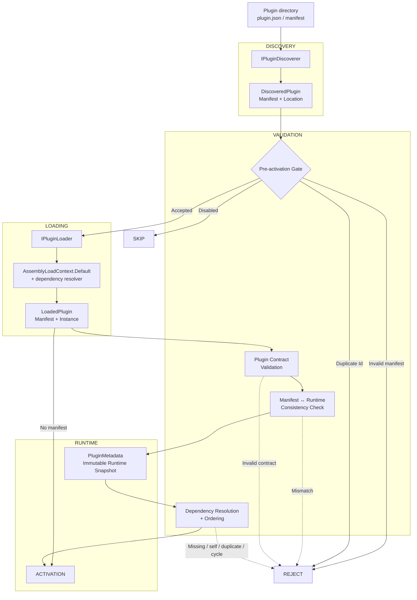

# [ADR-028] Kontrakt wtyczek i architektura dynamicznego ładowania

## Kontekst

Projekt `AuthKit.Host` wymaga dynamicznego odkrywania i ładowania wtyczek podczas startu, zanim kontener DI i infrastruktura (Wolverine, Marten) zostaną w pełni skonfigurowane. Istniejący interfejs `IAuthKitPlugin` eksponował jedynie `Name`, `Version` (jako ciąg znaków) oraz `Description`, co było niewystarczające do właściwego zarządzania cyklem życia wtyczek, sprawdzania zgodności i rozwiązywania zależności.

Sygnatura metody `PluginLoader.LoadPlugins()` zmieniła się z 2 na 3 wymagane parametry (`pluginsRootPath, ILogger logger, SemanticVersion hostVersion`), powodując błąd kompilacji, który trzeba było naprawić poprzez wyodrębnienie wersji hosta z metadanych złożenia.

## Problem

1. **Błąd kompilacji**: wywołanie `PluginLoader.LoadPlugins(pluginsPath, pluginLogger)` z 2 argumentami, podczas gdy metoda wymaga 3 wymaganych parametrów
2. **Brak świadomości wersji hosta**: wtyczki nie mogły być odrzucane na podstawie wymagań minimalnej wersji hosta (bramka `MinHostVersion` G3)
3. **Brak wsparcia manifestów**: brak walidacji metadanych wtyczki przed aktywacją (tagi, zależności, status włączenia, kontrole spójności)
4. **Brak stabilnej identyfikacji wtyczek**: brak unikalnego pola `Id` do deduplikacji, rozwiązywania zależności i unikalności w hoście
5. **Brak klasyfikacji możliwości**: brak zbioru `Capabilities` do kontroli hosta przed aktywacją

## Decyzja

### A1. Identyfikator wtyczki (`IAuthKitPlugin.Id`)
- Dodano `string Id { get; }` do interfejsu `IAuthKitPlugin`
- Autorzy wtyczek deklarują stabilne identyfikatory (np. `authkit.devtokens`)
- Host weryfikuje format i unikalność przed aktywacją
- **Odrzucono**: używanie `Guid` jako `Id` (słaba czytelność w manifestach, logach, CLI i konfiguracji)

### A2. Wersja o silnym typowaniu (`IAuthKitPlugin.Version`)
- Zastąpiono `string Version` przez `SemanticVersion Version`
- Parsowanie, równość i porównywanie SemVer 2.0.0 z poprawnym pierwszeństwem
- Metadane kompilacji ignorowane dla pierwszeństwa (`1.0.0+abc == 1.0.0+xyz`)
- **Zmiana przełomowa**: istniejące implementacje `string Version => "1.2.3"` muszą zostać zmigrowane do `SemanticVersion Version`

### A3-A8. Opisowa powierzchnia metadanych
- `string? Author`, `string? License`, `string? LicenseUrl`, `string? Homepage`, `string? RepositoryUrl`
- `IReadOnlyList<string> Tags` dowolna klasyfikacja, elementy null/zawierające tylko białe znaki są nieprawidłowe. Domyślnie `Array.Empty<string>`.
- `int Priority` niższa wartość = wcześniejsza aktywacja wśród wtyczek w innych aspektach niezależnych. Zależności zawsze mają pierwszeństwo przed `Priority`. Domyślnie `0`.
- `bool IsEnabled` domyślnie `true`. Gdy `IsEnabled` pochodzi z manifestu, wyłączone wtyczki są pomijane przed aktywacją złożenia.
- `string? DisplayName` UI pokazuje regułę rezerwową `DisplayName ?? Name`. Domyślnie `null`.
- `IReadOnlyList<string> DependsOn` deklaruje wartości `Id` wtyczek (nigdy nazw wyświetlanych). Domyślnie `Array.Empty<string>`.

### A9. MinHostVersion
- **Odroczone**: `MinHostVersion` nie jest częścią bieżącego kontraktu wtyczki, ale jest planowane w przyszłej implementacji.
- **Uwaga**: kontrole zgodności hosta (G3) nie są obecnie egzekwowane. Funkcja zostanie przywrócona, gdy `MinHostVersion` zostanie dodane do kontraktu w przyszłej iteracji.

### A10. DependsOn
- `IReadOnlyList<string> DependsOn` deklaruje wartości `Id` wtyczek (nigdy nazw wyświetlanych)
- **Wykrywanie cykli**: cykle w zależnościach są wykrywane algorytmem **przeszukiwania w głąb (DFS)** ze zbiorem `visiting` śledzącym bieżącą ścieżkę przechodzenia. W przypadku wykrycia cyklu wszystkie wtyczki zaangażowane w cykl są odrzucane jako błąd startu.
- **Rozstrzyganie priorytetów**: pole `Priority` (A3-A8) rozstrzyga remisy **wyłącznie w ramach poprawnego porządku topologicznego** i nie przesłania krawędzi zależności (`DependsOn`).
- G7 weryfikuje: brakujące → błąd startu, własne → odrzucenie, duplikat → odrzucenie, cykl → błąd startu

### A11. Capabilities
- `IReadOnlySet<string> Capabilities` równość zbiorów porządkowa bez uwzględniania wielkości liter. Domyślnie niemodyfikowalny pusty zbiór.
- Używane do kontroli możliwości hosta przed aktywacją oraz walidacji kontraktu w czasie działania.

### A12. PluginMetadata
- Niemutowalna migawka uruchomieniowa poprzez `PluginMetadataExtensions.GetMetadata()`
- Agreguje metadane kontraktu wtyczki w pojedynczą niemutowalną migawkę uruchomieniową
- Kontrola spójności między manifestem a instancją uruchomieniową niezgodność → odrzucenie
- **Uwaga**: walidacja spójności koncentruje się na metadanych niezwiązanych z wersją (np. `Tags`, `DependsOn`, `Capabilities`).

### A13. DisplayName
- `string? DisplayName` dostarcza czytelną dla człowieka nazwę wtyczki dla UI i diagnostyki.
- Gdy nie podano, rezerwowo używane jest `Name`.

### B. Projekcja manifestu wtyczki przed aktywacją
- `PluginManifest` odzwierciedla wybrane elementy uruchomieniowe `IAuthKitPlugin` do użycia przed aktywacją (G2)
- Wyszukiwane w katalogach wtyczek: `plugin.manifest.json`, `manifest.json`, `{pluginName}.manifest.json`
- **Przyszły kierunek manifestów**: choć manifesty są obecnie opcjonalne dla zgodności wstecznej, długoterminowym celem jest egzekwowanie obowiązkowych manifestów dla pełnej walidacji spójności (G2). Wtyczki bez manifestów ładują się bez walidacji, co może prowadzić do nieoczekiwanego zachowania w przyszłych wydaniach.
- Jeśli nie znaleziono manifestu: `manifest` to `null`, wtyczka ładuje się bez walidacji spójności (ścieżka rezerwowa)
- Jeśli znaleziono manifest: weryfikowane tagi, depends-on, IsEnabled, kontrola duplikatów Id
- Kontrola spójności między manifestem a instancją uruchomieniową po załadowaniu.

### C. Walidacja i ładowanie

#### Walidacja przed aktywacją (gdy manifest istnieje)
1. **Odkrywanie wtyczek**: skanowanie `pluginsRootPath` w poszukiwaniu podkatalogów
2. **Kontrola wejściowego złożenia**: każdy katalog musi zawierać `{pluginName}.dll`
3. **Parsowanie manifestu**: próba `plugin.manifest.json` → `manifest.json` → `{pluginName}.manifest.json`

**Uwaga**: host wywodzi swój `SemanticVersion` z metadanych złożenia i przekazuje go jawnie do `PluginLoader`. Wartość ta jest obecnie informacyjna i nie jest używana do walidacji zgodności wtyczek. Bramkowanie zgodności poprzez `MinHostVersion` jest odroczone.

5. **Walidacja przed aktywacją** (gdy manifest istnieje):
   - Walidacja składni i struktury manifestu
   - Walidacja `Tags`
   - Walidacja `DependsOn` (brakujące, własne, duplikaty, cykl)
   - Walidacja `IsEnabled`
   - Walidacja duplikatów `Id`
   - Wyłączone wtyczki (`IsEnabled = false`) są pomijane przed aktywacją złożenia.

6. **Ładowanie złożeń**: `AssemblyLoadContext.Default.LoadFromAssemblyPath()` z resolverem zależności

#### Walidacja uruchomieniowa (po załadowaniu złożenia)
7. **Tworzenie instancji wtyczki**: `Activator.CreateInstance(pluginType)` → `IAuthKitPlugin`
8. **Kontrola duplikatów `Id` w czasie ładowania**
9. **Walidacja spójności** między manifestem a instancją uruchomieniową (jeśli manifest istnieje)
   - Weryfikuje metadane niezwiązane z wersją (np. `Tags`, `DependsOn`, `Capabilities`).
10. **Utworzenie `PluginMetadata`** jako niemutowalnej migawki kontraktu uruchomieniowego
11. **Aktywacja wtyczki**

**Uwagi:**
- `MinHostVersion` jest planowane w przyszłej implementacji w celu egzekwowania zgodności wersji hosta (G3).
- Walidacja spójności manifestu koncentruje się na metadanych niezwiązanych z wersją, w tym `Tags`, `DependsOn` i `Capabilities`.
- Manifesty pozostają opcjonalne dla zgodności wstecznej; wtyczki bez manifestów podążają rezerwową ścieżką ładowania bez walidacji spójności.

### Tagi
#PluginContract #DynamicLoading #G2 #G7

### Data
2026-09-04

### Zakres
Plugins

### Poprzedni
ADR-027: Kompiluj interfejs DevTools z modularnego TypeScript do pojedynczego zasobu osadzonego

### Następny
ADR-029: Eksponowanie ustrukturyzowanych i anulowalnych wyników kondycji wtyczek

## Konsekwencje

### Pozytywne
- Wtyczki mogą być referencjonowane poprzez stabilny unikalny identyfikator (`Id`)
- Metadane wtyczki mogą być walidowane przed aktywacją, gdy manifest jest dostępny
- Wyłączone wtyczki mogą być pomijane przed aktywacją złożenia, gdy zadeklaruje to manifest
- Metadane kontraktu wtyczki są dostępne jako niemutowalna migawka `PluginMetadata`
- Deklaracje zależności mogą być walidowane i rozwiązywane deterministycznie
- Niespójności manifestu/czasu działania mogą być wykrywane przed aktywacją
- Metadane wtyczki są dostępne przed konfiguracją kontenera DI
- Nowi kontrybutorzy mogą zrozumieć kontrakt wtyczki i decyzje dotyczące ładowania

### Negatywne
- Zmiana `Version` z `string` na `SemanticVersion` jest przełomowa (wymaga migracji)
- Wtyczki bez manifestu nadal ładują się bez walidacji spójności manifestu/czasu działania
- Zgodność wersji hosta (`MinHostVersion`) jest planowana w przyszłej implementacji
- Egzekwowanie manifestów jest odroczone do przyszłej iteracji
- Autorzy wtyczek muszą wykonywać więcej walidacji w czasie kompilacji i kontraktu

### Diagram konsekwencji

**Wyjaśnienie diagramu**:
- **Odkrywanie**: `IPluginDiscoverer` skanuje katalogi wtyczek i parsuje manifesty.
- **Bramka przed aktywacją**: weryfikuje składnię manifestu, `Tags`, `DependsOn`, `IsEnabled` oraz duplikaty `Id`.
- **Ładowanie**: ładuje złożenia i tworzy instancje `IAuthKitPlugin`.
- **Walidacja**: zapewnia spójność kontraktu między manifestem a instancją uruchomieniową.
- **Rozwiązywanie zależności**: weryfikuje i porządkuje wtyczki na podstawie `DependsOn` i `Priority`.
- **Aktywacja**: ostatni krok po pomyślnej walidacji i rozwiązaniu.
