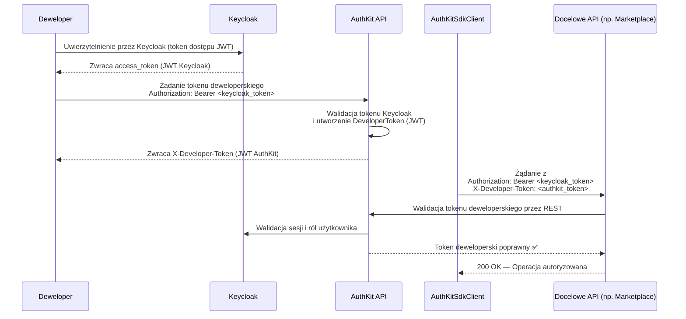
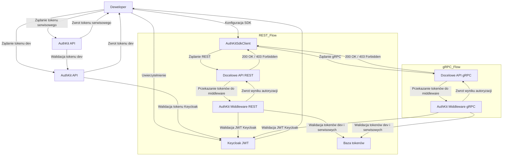
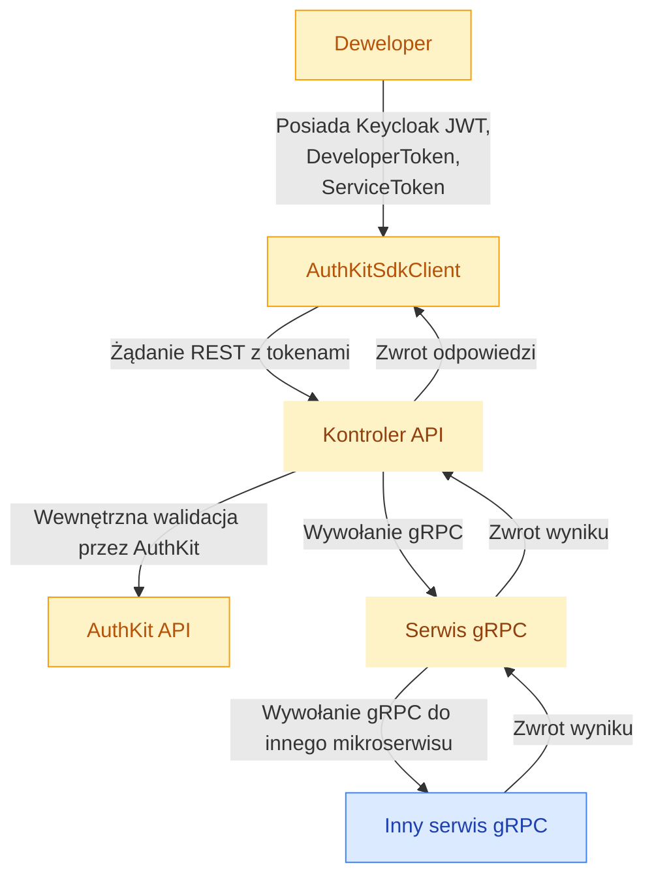

# Schematy AuthKit

Ten dokument zawiera diagramy Mermaid opisujące przepływy tokenów i architekturę AuthKit.

## Wydawanie tokenów i przepływ żądań SDK

## Zewnętrzny REST vs wewnętrzny przepływ gRPC

## Przepływ wywołań funkcji SDK (AuthKit → mikroserwisy gRPC)

